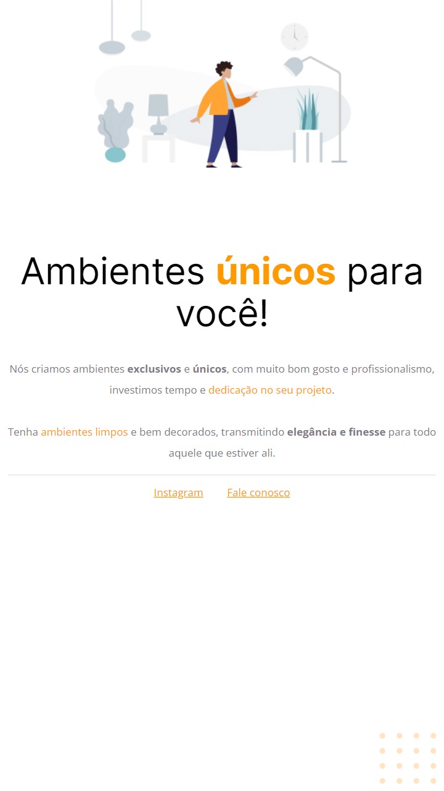

# Projeto 01 | Programa Explorer da Rocketseat

[🔗 Clique aqui para acessar](https://alineviana.github.io/html-css/)

 

> 🖥️ Tecnologias

- HTML
- CSS
- Git e GitHub

 

> 📫 Contato

<<<<<<< HEAD
 -  
=======
 -  
>>>>>>> 81124f54cae57649d3a1207cd4dc8962237ad362
